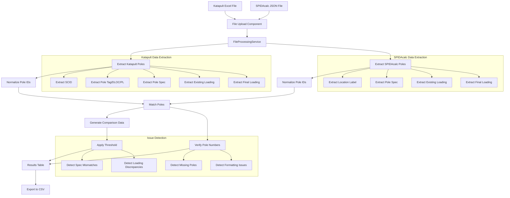
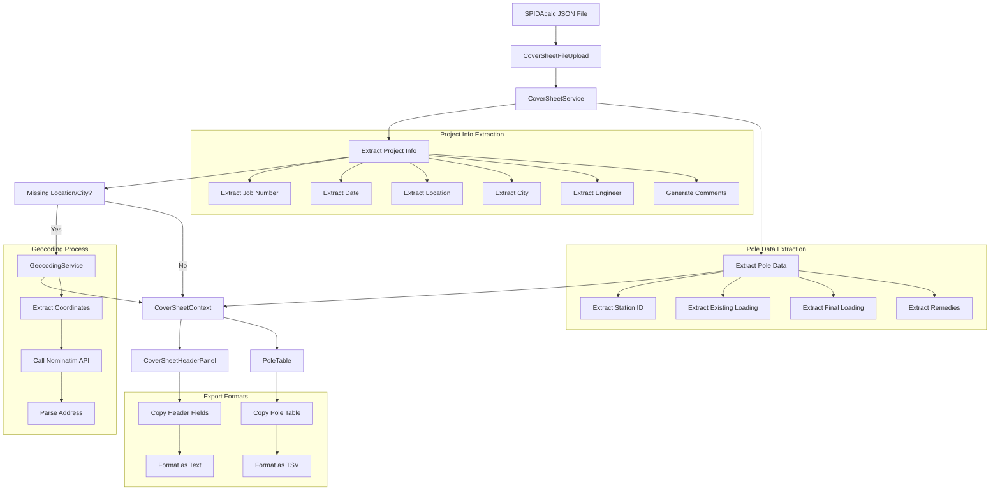
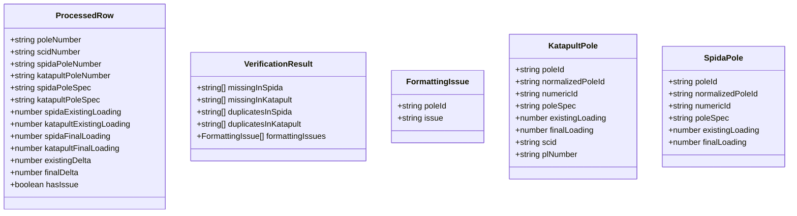
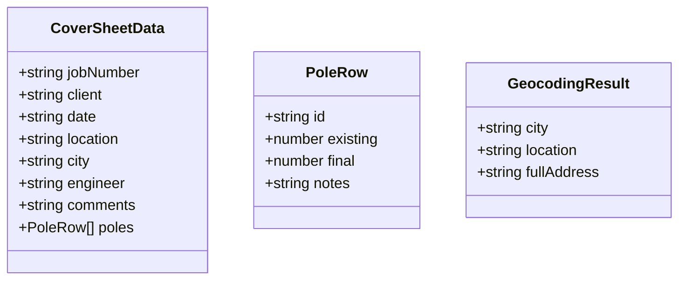

# Data Flow Documentation

This document provides a visual representation of how data flows through the application for both the Pole Comparison Tool and the Cover Sheet Tool.

## Pole Comparison Tool Data Flow



## Cover Sheet Tool Data Flow



## Data Structure

### Pole Comparison Data Structure



### Cover Sheet Data Structure



## File Structure and Dependencies

```mermaid
flowchart TD
    A[index.html] --> B[main.tsx]
    B --> C[App.tsx]
    C --> D[Index.tsx]
    C --> E[CPSTool.tsx]
    C --> F[HowToGuide.tsx]
    
    D --> G[FileUpload.tsx]
    D --> H[ResultsTable.tsx]
    G --> I[FileProcessingService.ts]
    
    E --> J[CoverSheetFileUpload.tsx]
    E --> K[CoverSheetHeaderPanel.tsx]
    E --> L[PoleTable.tsx]
    J --> M[CoverSheetService.ts]
    M --> N[GeocodingService.ts]
    
    subgraph "Pole Comparison Tool"
        D
        G
        H
        I
    end
    
    subgraph "Cover Sheet Tool"
        E
        J
        K
        L
        M
        N
    end
    
    subgraph "Shared Components"
        O[Header.tsx]
        P[UI Components]
    end
    
    D --> O
    E --> O
    F --> O
